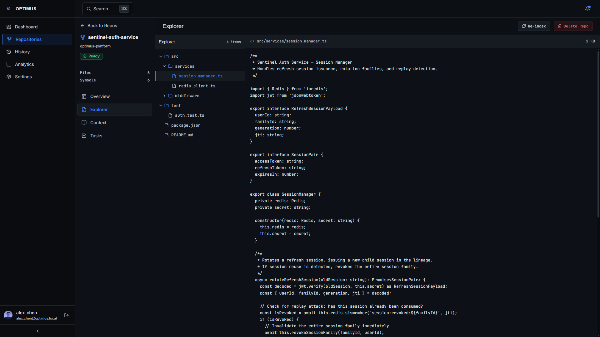
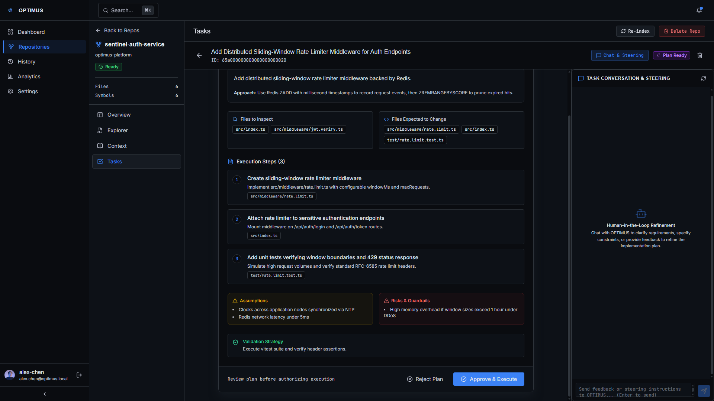
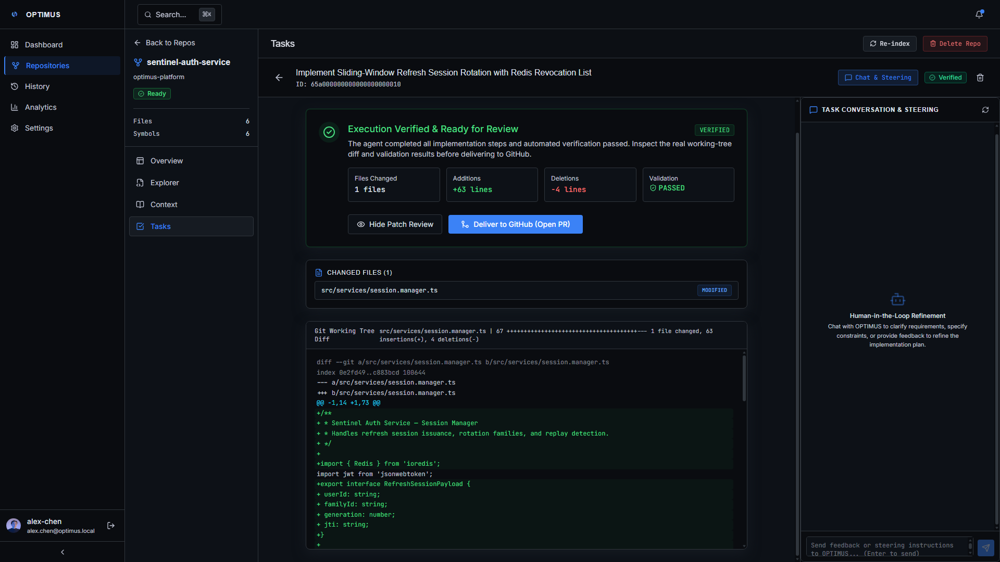
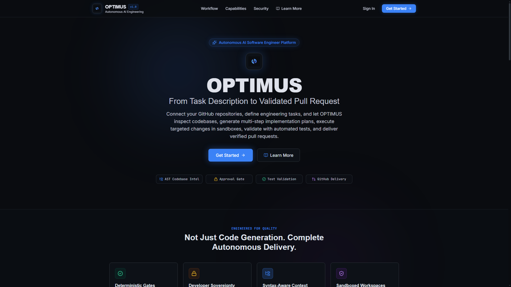

# OPTIMUS — Autonomous AI Software Engineer Platform

OPTIMUS is an autonomous engineering platform that inspects codebases, generates implementation plans, iteratively executes code modifications through specialized toolkits, validates diffs, and delivers pull requests.

---

## Architecture Overview

```
+------------------------------------------------------------------------------+
|                       Frontend (React 19 + Vite)                             |
|         Stitch "Deep Space Dark" Design System & Lucide Icons                |
+--------------------------------------+---------------------------------------+
                                       | HTTP / REST (CORS + Cookies)
                                       v
+------------------------------------------------------------------------------+
|                        Backend API (Express 5)                               |
|  - Rate Limiting (In-Memory Sliding Window)                                  |
|  - Security Headers (X-Content-Type, X-Frame-Options, etc.)                  |
|  - Auth Middleware (JWT Cookies, Google Firebase, GitHub OAuth)              |
|  - REST Endpoints (/auth, /repositories, /tasks, /settings, /api)            |
+-----------+--------------------------+---------------------------+-----------+
            |                          |                           |
            | HTTP (POST /execute)     | Mongoose                  | OpenRouter REST
            v                          v                           v
+-----------------------+   +-----------------------+   +----------------------+
|    Worker Sandbox     |   |   MongoDB Database    |   |      AI Gateway      |
| - Isolated Container  |   | - Users & Accounts    |   | - OpenRouter Multi-  |
| - Sterile Runtime Env |   | - Repos & Branches    |   |   Model Fallback     |
| - Command Allowlist   |   | - Tasks, Plans, Diffs |   | - Autonomous Tool    |
| - Token Scrubbing     |   | - Executions & Audit  |   |   Calling Engine     |
| - Resource/FS Bounds  |   | - User Settings & Env |   | - Offline Mock Suite |
+-----------------------+   +-----------------------+   +----------------------+
```

---

## Core Capabilities

- **Codebase Indexing & AST Analysis**: Automatically crawls imported repositories, parses abstract syntax trees (via Babel and Acorn), and builds symbol definitions and file hierarchies.
- **AI Planning & Approval Workflow**: Synthesizes multi-step implementation plans detailing affected files, structural assumptions, and diff previews prior to execution approval.
- **Autonomous Multi-Turn Execution**: Executes safe file modifications, inspections, and command validations within bounded turn limits and configurable autonomy levels.
- **Pull Request Delivery**: Formats branch diffs and delivers pull requests directly to linked GitHub repositories.
- **Configurable Preferences & Environment**: Stores per-user environment variables and AI engine preferences (default model, turn constraints, autonomy level) backed by MongoDB.
- **Hardened Security**: Includes sliding-window rate limiters, strict HTTP security headers, CORS origin verification, and isolated credential management.

---

## UI Showcase

### 1. AST Codebase Explorer

*Interactive repository workspace featuring syntax-tree symbol extraction (classes, methods, dependencies), file hierarchy navigation, and real-time TypeScript file preview.*

### 2. AI Implementation Plan & Approval Gate

*Deterministic planning stage presenting multi-step execution sequences, affected files, structural assumptions, and risks before requiring explicit developer authorization.*

### 3. Execution Review, Validation & Unified Diff

*Post-execution review displaying automated validation results (`vitest`), changed files breakdown, and color-coded unified git diff viewer prior to GitHub pull request creation.*

### 4. Platform Overview & Workflow Pipeline

*Public onboarding view outlining the 9-stage deterministic engineering pipeline from repository ingestion to verified pull request delivery.*

---

## Tech Stack

| Layer | Technologies |
|---|---|
| **Frontend** | React 19, Vite, Tailwind CSS, Lucide React, React Router 7 |
| **Backend** | Node.js 20, Express 5, Mongoose 9, JWT, Cookie-Parser |
| **Database** | MongoDB 6+ |
| **AI Gateway** | OpenRouter REST API (Free-tier model hierarchy with fallback) |
| **Worker** | Isolated containerized execution sandbox with sterile environment and polyglot command runner |
| **Containers** | Multi-stage Dockerfiles (`api`, `frontend`, `worker`), Docker Compose |

---

## Project Layout

```
Optimus/
|-- backend/               # Express 5 API Server
|   |-- src/
|   |   |-- ai/            # OpenRouter Gateway & Execution Engine
|   |   |-- config/        # Database & Firebase configuration
|   |   |-- controllers/   # Route handlers (auth, repos, tasks, settings, etc.)
|   |   |-- middleware/    # Auth verification & rate limiting
|   |   |-- models/        # Mongoose schemas (User, Task, Settings, etc.)
|   |   |-- routes/        # Express routers
|   |   `-- services/      # Code execution, indexing, recovery services
|   `-- .env.example       # Backend environment template
|-- frontend/              # Vite + React 19 Single-Page Application
|   |-- src/
|   |   |-- components/    # AppShell, Navigation, Shared UI
|   |   |-- features/      # Auth context, Repositories, Tasks
|   |   |-- pages/         # Dashboard, Analytics, History, Settings
|   |   `-- App.jsx        # Routing configuration
|   `-- .env.example       # Frontend environment template
|-- worker/                # Sandboxed execution worker
|   |-- src/
|   |   |-- executor.js    # Sterile process containment & resource bounding
|   |   |-- runners.js     # Polyglot command validation & execution mappings
|   |   `-- worker.js      # Worker HTTP server (POST /execute)
|   |-- test/              # Worker security test suite
|   `-- Dockerfile         # Hardened worker container
|-- infrastructure/        # Docker Compose & container definitions
|   |-- Dockerfile.api     # Multi-stage API image
|   |-- Dockerfile.frontend# Nginx SPA image
|   `-- docker-compose.yml # Container orchestration
|-- docs/                  # Showcase captures and documentation assets
|   `-- screenshots/       # High-fidelity UI screenshots
|-- .github/               # CI workflows, PR & issue templates
|-- OPTIMUS.pdf            # Architecture design & benchmark specification
`-- SECURITY.md            # Responsible disclosure & execution security policy
```

---

## Quick Start (Local Development)

### 1. Prerequisites
- **Node.js**: v20.x or later
- **npm**: v10.x or later
- **MongoDB**: Local instance running on `localhost:27017` or MongoDB Atlas URI

### 2. Environment Configuration
Copy `.env.example` templates and configure values:

```bash
# Backend
cp backend/.env.example backend/.env

# Worker
cp worker/.env.example worker/.env

# Frontend
cp frontend/.env.example frontend/.env
```

### 3. Start Backend
```bash
cd backend
npm install
npm run dev
# Server listens on http://localhost:3000
```

### 4. Start Worker
```bash
cd worker
npm install
npm start
# Worker sandbox listens on http://localhost:8080
```

### 5. Start Frontend
```bash
cd frontend
npm install
npm run dev
# Frontend runs on http://localhost:5173
```

### 6. Seed Showcase Fixtures (Optional)
To inspect and demonstrate the authenticated web UI with realistic, pre-indexed project data without executing a live multi-turn agent run:

```bash
cd backend
npm run seed:showcase
```

> **Note**: This command populates deterministic synthetic demonstration fixtures (sample repository, AST symbol index, implementation plan, and patch review diff) strictly for local UI evaluation. It is development-only, introduces zero production credentials, and safely aborts if `NODE_ENV=production`.

---

## Running with Docker Compose

Run the complete platform stack (API, Frontend, Worker, MongoDB) via Docker Compose:

```bash
cd infrastructure
docker compose up -d --build
```

Access points:
- **Frontend SPA**: `http://localhost:5173`
- **Backend API**: `http://localhost:3000`
- **Worker Sandbox**: `http://localhost:8080/health` (Execution at `POST /execute`)
- **MongoDB**: `localhost:27017`

To inspect service health:
```bash
docker compose ps
docker compose logs -f api
```

---

## Health Probes

The backend exposes diagnostic endpoints for container orchestrators:
- `GET /api/health` — Basic service status
- `GET /api/health/live` — Liveness probe (uptime and timestamp)
- `GET /api/health/ready` — Readiness probe (database connection and AI gateway status)

---

## Security Policy

See [`SECURITY.md`](SECURITY.md) for vulnerability disclosure policies, sandbox boundaries, and credential hygiene practices.

---

## License

Internal proprietary software. All rights reserved.
